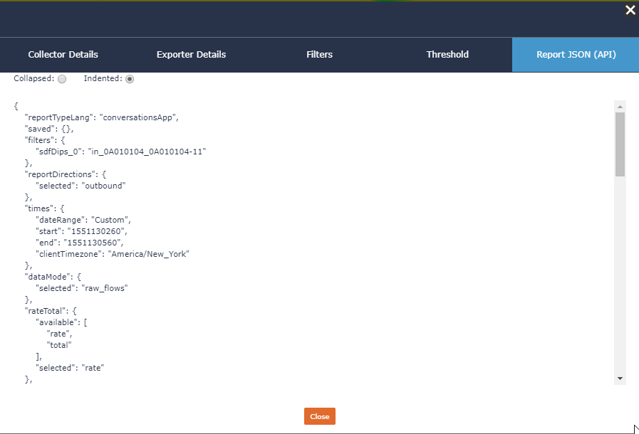

.. _report_json:

Report JSON (API)
=================

Any report within Scrutinizer provides an option where you can view the JSON data that is passed from the front end to the back end in order to render the reports. 

Experimenting with this tab will be very helpful as you being to build your :class:`scrutinizer_api.scrut_json`.

